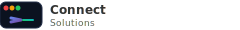

# Connect Solutions Branding Package

Este pacote contém todos os arquivos necessários para integrar a identidade visual da Connect Solutions em outros projetos.

## 📁 Arquivos Incluídos

### 🎨 Logo Principal
- **`logo.svg`** - Logo completo Connect Solutions (240x30px)
- **`favicon.svg`** - Favicon para aba do navegador (24x24px)

### 🧩 Componentes
- **`header-component.html`** - Header completo pronto para uso
- **`header-styles.css`** - Estilos CSS para o header
- **`favicon-integration.html`** - Exemplos de integração do favicon

## 🚀 Como Usar

### 1. Integração Rápida (HTML + CSS)

```html
<!-- 1. Incluir o CSS -->
<link rel="stylesheet" href="header-styles.css">

<!-- 2. Copiar o HTML do header -->
<!-- (conteúdo do header-component.html) -->
```

### 2. Apenas o Logo

```html
<!-- Usar o arquivo SVG diretamente -->


<!-- Ou inline -->
<!-- (conteúdo do logo.svg) -->
```

### 3. Favicon

```html
<!-- Método recomendado: SVG inline -->
<link rel="icon" href="data:image/svg+xml,<svg xmlns='http://www.w3.org/2000/svg' viewBox='0 0 24 24'>...</svg>">
```

## 🎨 Cores da Marca

- **Primária**: #667eea → #764ba2 (gradiente azul-roxo)
- **Secundária**: #22c55e → #06b6d4 (gradiente verde-ciano)
- **Terminal**: #0b1220 (fundo escuro)
- **Texto**: #333 (cinza escuro)

## 📱 Responsividade

O header é totalmente responsivo:
- **Desktop**: Logo completo (240x30px)
- **Tablet**: Logo reduzido (200x25px)
- **Mobile**: Logo compacto (160x20px)

## 🔧 Customização

### Alterar Tamanho do Logo
```css
.company-logo {
    width: 200px; /* ajuste conforme necessário */
    height: 25px;
}
```

### Alterar Cores
```css
.logo {
    color: #sua-cor; /* cor do texto do produto */
}
```

### Alterar Espaçamento
```css
.header-brand {
    gap: 15px; /* espaço entre logos */
}
```

## 📋 Checklist de Integração

- [ ] Copiar `header-styles.css` para seu projeto
- [ ] Incluir o HTML do header em sua página
- [ ] Ajustar links de navegação
- [ ] Personalizar logo do produto
- [ ] Adicionar favicon
- [ ] Testar responsividade
- [ ] Verificar em diferentes navegadores

## 🎯 Casos de Uso

- ✅ Sites corporativos
- ✅ Documentação técnica
- ✅ Dashboards administrativos
- ✅ Aplicações web internas
- ✅ Landing pages de produtos

## 📞 Suporte

Para dúvidas ou customizações específicas, entre em contato:
- **Email**: rodrigo.oliveira@connectsolutions.com.br
- **GitHub**: https://github.com/rudrigando

---

**© 2025 Connect Solutions. Todos os direitos reservados.**
